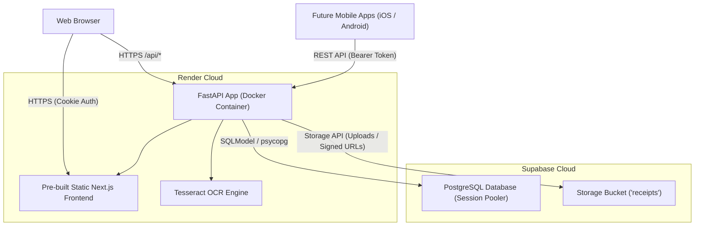

# Web Application Deployment Plan: Supabase & Render

This document outlines the step-by-step plan to transition TracepAI from a local Docker container to a production web application hosted on **Render** with **Supabase** (PostgreSQL & Object Storage). It also establishes the foundational architecture for the upcoming iOS (App Store) and Android (Google Play) applications.

---

## 1. Architecture Overview



### Core Architecture Decisions:
1. **Single Unified Container on Render**: Render deploys the existing multi-stage `Dockerfile`. FastAPI serves the static Next.js export at `/` and the API at `/api`. This eliminates cross-origin resource sharing (CORS) complexity and maintains single-domain cookie authentication for the web.
2. **Supabase PostgreSQL**: Replaces the local ephemeral SQLite file (`tracepai.db`). Persists data across container restarts and redeployments.
3. **Supabase Storage**: Replaces the ephemeral `/data/receipts` folder. Stores receipt images and PDFs permanently in a private Supabase bucket.
4. **Dual Authentication (Cookie + Bearer Token)**: Preserves existing cookie-based web auth while enabling `Authorization: Bearer <token>` for future mobile applications.

---

## 2. Side Information Needed from User

Before deploying to Render, the following credentials must be ready:

1. **`DATABASE_URL`**:
   * From Supabase dashboard: **Connect** button (or **Settings > Database**).
   * Choose **Session Pooler** (port 5432) or **Transaction Pooler** (port 6543).
   * Format: `postgresql://postgres.[ref]:[PASSWORD]@[host]:5432/postgres?sslmode=require`
   * *Note: Passwords containing special characters must be URL-encoded.*
2. **`SUPABASE_URL`**:
   * Format: `https://[ref].supabase.co`
3. **`SUPABASE_SERVICE_ROLE_KEY`** (or `sb_secret_...`):
   * Found in **Settings > API** (or Connect modal). Needed by the backend to securely upload receipts to Supabase Storage.
4. **Supabase Storage Bucket**:
   * In Supabase dashboard: **Storage > New Bucket**.
   * Name: `receipts` (Private bucket).
5. **Render Account & Git Repository**:
   * A GitHub or GitLab repository connected to Render.

---

## 3. Phased Implementation Plan

### Phase 1: Dependency Management
Add production PostgreSQL drivers and the Supabase SDK to `backend/pyproject.toml`.

* **Packages**:
  * `psycopg[binary]>=3.2.0`: Modern, high-performance PostgreSQL driver for Python.
  * `supabase>=2.10.0`: Official Supabase Python SDK for storage management.
* **Commands**:
  ```bash
  cd backend
  uv add "psycopg[binary]>=3.2.0" "supabase>=2.10.0"
  uv lock
  ```

---

### Phase 2: Database Layer (`backend/app/db.py` & `backend/app/fx.py`)

#### 2.1 Dynamic Database Engine (`app/db.py`)
Support both local SQLite (default fallback) and remote Supabase PostgreSQL via `DATABASE_URL`.

* Normalize connection schemes (`postgres://` and `postgresql://` converted to `postgresql+psycopg://`).
* Enable `pool_pre_ping=True` and connection pooling for PostgreSQL.

#### 2.2 Cross-Database Migration Support (`app/db.py`)
Replace the SQLite-only `PRAGMA table_info` check in `add_missing_columns()` with SQLAlchemy's dialect-agnostic `inspect` tool:
* On SQLite: Retains lightweight alter queries.
* On PostgreSQL: Uses SQLAlchemy `inspect(conn)` and executes `ALTER TABLE ... ADD COLUMN IF NOT EXISTS ...`.

#### 2.3 PostgreSQL Dialect Support in FX (`app/fx.py`)
Update `refresh()` in `backend/app/fx.py`:
* The current code imports SQLite-specific upsert: `from sqlalchemy.dialects.sqlite import insert`.
* Dynamically select the dialect-appropriate `insert` based on `engine.dialect.name`:
  * If `postgresql`: `from sqlalchemy.dialects.postgresql import insert`
  * Else: `from sqlalchemy.dialects.sqlite import insert`

---

### Phase 3: Supabase Storage Integration (`backend/app/routers/receipts.py`)

Extract receipt file operations into a storage adapter supporting both local disk and Supabase:

1. **Storage Utility (`backend/app/storage.py`)**:
   * If `SUPABASE_URL` and `SUPABASE_SERVICE_ROLE_KEY` are defined:
     * `save_file(name, content, mime_type)`: Uploads to Supabase `receipts` bucket.
     * `get_file_url(name)`: Generates a signed URL (expires in 1 hour).
   * Otherwise (Local / Offline / Test environment):
     * Fallback to writing/reading from `TRACEPAI_DATA_DIR/receipts`.
2. **Update `backend/app/routers/receipts.py`**:
   * `scan()`: Call storage adapter to upload the receipt.
   * `get_receipt()`: Redirect to the signed URL if cloud storage is active, or return `FileResponse` if local.

---

### Phase 4: Mobile-Ready Authentication (`backend/app/auth.py`)

Enable seamless authentication for both web (cookies) and mobile (bearer tokens):

1. **FastAPI Dependency Update in `current_user`**:
   * Inspect both `Cookie(session_token)` and `HTTPBearer(auto_error=False)` header.
   * Authenticate against `Session` table using whichever credential is provided.
2. **Login/Signup Response**:
   * Return `{"username": user.username, "token": token}` in the response payload.
   * Web browsers continue using the `Set-Cookie` header automatically.
   * Mobile clients can read `token` and store it in secure device storage (Keychain / EncryptedSharedPreferences).

---

### Phase 5: Container & Deployment Optimization (`Dockerfile`)

Update the Docker configuration to satisfy Render's environment:

1. **Dynamic Port Binding**:
   Render assigns a dynamic `$PORT` (typically 10000). Update `Dockerfile`:
   ```dockerfile
   EXPOSE 8000
   CMD ["sh", "-c", "uv run --no-sync uvicorn app.main:app --host 0.0.0.0 --port ${PORT:-8000}"]
   ```
2. **Build Verification**:
   Verify building the multi-stage Docker image locally to ensure Tesseract OCR, frontend build, and backend packaging pass without issues.

---

## 4. Testing & Verification Plan

### Automated Test Suite
Create dedicated tests for the new cloud integrations while maintaining 100% of existing tests:

1. **`backend/tests/test_cloud_db.py`**:
   * Test database URL normalization (`postgres://` -> `postgresql+psycopg://`).
   * Test dialect resolution in FX upsert (`sqlite` vs `postgresql`).
   * Test `add_missing_columns` inspector compatibility.
2. **`backend/tests/test_dual_auth.py`**:
   * Verify login via cookie returns valid user.
   * Verify request with `Authorization: Bearer <token>` succeeds without cookie.
   * Verify request without either returns 401.
3. **`backend/tests/test_storage.py`**:
   * Test local fallback storage writes and reads file.
   * Mock Supabase client to test bucket upload and signed URL redirection.
4. **Full Regression Test**:
   ```bash
   cd backend
   uv run pytest
   ```
   All 78+ tests must pass.

---

## 5. Render Deployment Instructions (for User)

Once the code is pushed to your Git repository:

1. Log in to [Render Dashboard](https://dashboard.render.com).
2. Click **New +** > **Web Service**.
3. Connect your repository.
4. Settings:
   * **Name**: `tracepai` (or preferred name)
   * **Environment**: `Docker`
   * **Region**: Choose closest to your Supabase project region (e.g., Oregon or Frankfurt).
   * **Instance Type**: Free (or Starter $7/mo for 0s cold-start & 1GB RAM).
5. **Environment Variables**:
   * `DATABASE_URL`: Your Supabase connection string.
   * `SUPABASE_URL`: `https://[ref].supabase.co`
   * `SUPABASE_SERVICE_ROLE_KEY`: `[your-service-role-key]`
   * `PYTHONUNBUFFERED`: `1`
6. Click **Create Web Service**.
7. Render will build the Docker container and deploy the app.

---

## 6. Future Mobile Roadmap (App Store & Google Play)

With this plan executed, moving to mobile will require zero changes to the backend:

1. **Mobile Options**:
   * **Capacitor / Ionic**: Packages the Next.js static build into native iOS and Android binaries with access to native camera and biometric plugins.
   * **React Native / Expo**: Reuses all API models and business logic with native mobile widgets.
2. **Mobile Requirements to Keep in Mind**:
   * **Account Deletion**: App Store guidelines require an explicit user-facing "Delete Account" option.
   * **Sign in with Apple**: Required if social logins (Google, etc.) are introduced later.
